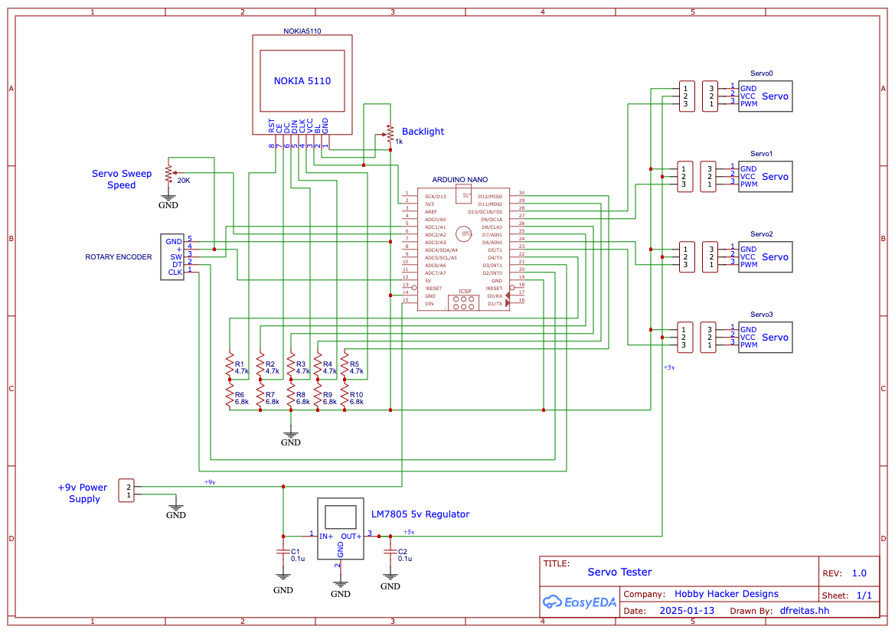
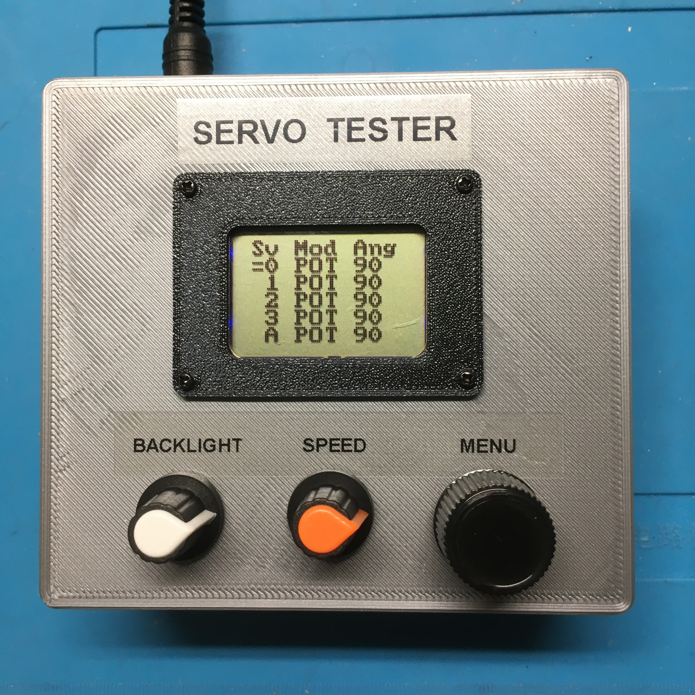

# ServoTester
* Servo control box for driving up to four servos.   
* Servos Can be swept automatically (SWP mode) or manually with a potentiometer (POT mode)
* Travel limits for each servo cam be set
* A global setting can be used to sweep or adjust all servos at once
* From the main menu, adjust the rotary knob to select the desired servo and click to enter the sub-menu
* From the sub menu, select the line you want to change and click to enter edit mode
* Adjust the value and click to save and exit edit
* Scroll to the "back" line and click to return to the top menu

dlf  1/3/2025

### Schematics

### Build Pictures

